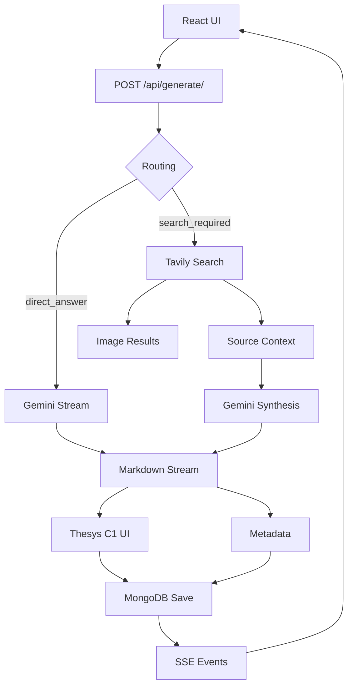
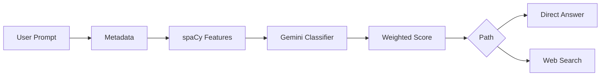
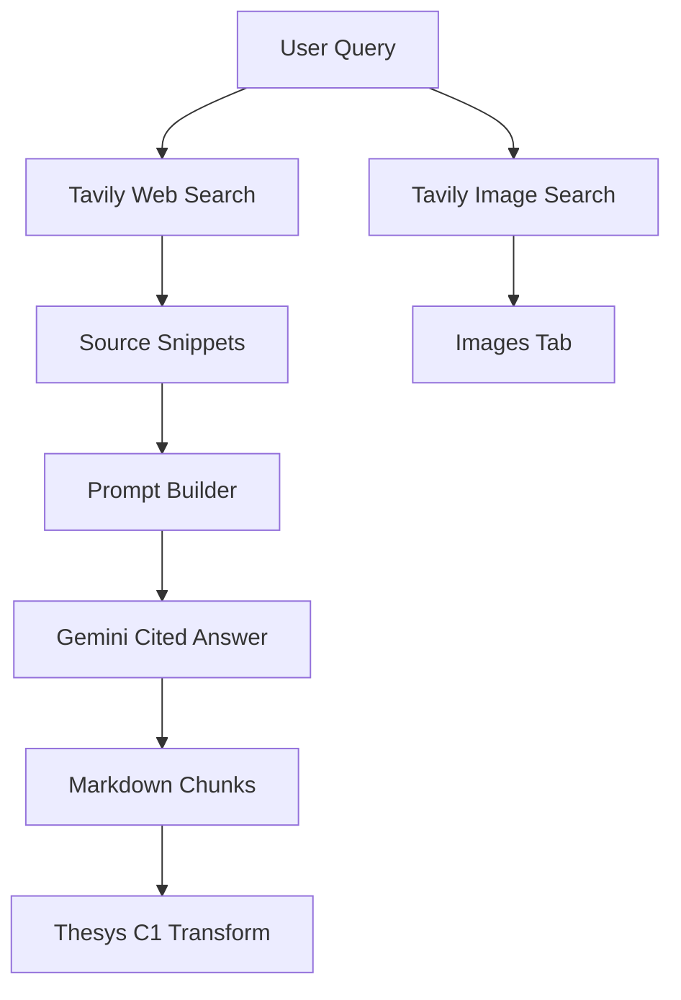

# ARGON

**AI-powered search, synthesis, and interactive answer rendering.**


ARGON is a Perplexity-style research assistant built with a Django backend and a React frontend. It decides whether a user question needs live web search, retrieves relevant sources with Tavily, streams a cited Markdown answer from Gemini, transforms the answer into an interactive UI with Thesys C1, and stores conversation memory in MongoDB.

The project is designed to show more than a chatbot. It demonstrates request routing, retrieval-augmented generation, streaming UX, source attribution, image search, persistent sessions, voice input, and deployable full-stack architecture.

> 💡 **Interview-friendly summary:** ARGON is a full-stack AI search product with routing, retrieval, streaming, memory, and interactive answer rendering.

---

## ✨ Quick Preview

| Layer | What It Does |
| --- | --- |
| 🎛️ Frontend | React + Vite chat interface, live streaming Markdown, tabbed answer/source/image views |
| ⚙️ Backend | Django async endpoints, SSE streaming, routing, retrieval, synthesis, metadata generation |
| 🔎 Search | Tavily web search and image search |
| 🧠 LLM | Gemini for routing, direct answers, cited synthesis, summaries, titles, and entities |
| 🎨 UI Generation | Thesys C1 DSL rendered with `@thesysai/genui-sdk` |
| 🗃️ Memory | MongoDB session storage with summaries and entities for follow-up context |

---

## 🧭 Table Of Contents

- [Core Idea](#core-idea)
- [Feature Highlights](#feature-highlights)
- [Architecture](#architecture)
- [Request Lifecycle](#request-lifecycle)
- [Backend Design](#backend-design)
- [Frontend Design](#frontend-design)
- [Database Schema](#database-schema)
- [API Reference](#api-reference)
- [Local Setup](#local-setup)
- [Deployment Guide](#deployment-guide)
- [Environment Variables](#environment-variables)
- [Known Improvements](#known-improvements)

---

## 🎯 Core Idea

Most AI chat apps use a single path for every prompt. ARGON uses a routed pipeline:

1. Understand the user query.
2. Decide whether live search is needed.
3. If search is needed, retrieve web and image results.
4. Synthesize a cited answer from retrieved context.
5. Stream the answer as Markdown.
6. Generate an interactive C1 UI from the final answer.
7. Save the turn to MongoDB for future context.

This makes the experience fast for simple questions and more grounded for current, factual, or source-sensitive questions.

```text
Simple question       -> Direct Gemini answer
Fresh/current topic   -> Tavily search + cited Gemini synthesis
Completed response    -> Thesys C1 UI + MongoDB memory
```

---

## 🚀 Feature Highlights

### 🧠 Intelligent Routing

ARGON runs a three-stage routing pipeline before answering:

- **Fast metadata extraction** identifies temporal wording, factual lookups, attached content, volatile domains, and generation intent.
- **NLP + LLM classification** uses spaCy and Gemini to classify the prompt into intent, entity type, scope, and verification need.
- **Weighted decision logic** chooses either `direct_answer` or `search_required`.

The routing score is deterministic once the classifier output is available:

```python
decision_score = (
    scores["intent_type_score"] * 0.32 +
    scores["entity_dynamism_score"] * 0.20 +
    scores["temporal_urgency_score"] * 0.20 +
    scores["context_dependency_score"] * -0.25 +
    scores["verification_need_score"] * 0.18 +
    scores["comprehensiveness_score"] * 0.05
)
```

### ⚡ Live Streaming UX

The backend returns a `text/event-stream` response. The frontend reads SSE chunks using `ReadableStream`, reconstructs event blocks, and updates the latest chat turn in real time.

Key events include:

- `analysis_complete`
- `steps`
- `sources`
- `images`
- `synthesis_start`
- `markdown_chunk`
- `aui_dsl`
- `turn_metadata`
- `finished`

### 🔎 Search And Source Grounding

For search-required prompts, ARGON:

- calls Tavily with advanced search,
- retrieves a quick Tavily answer when available,
- collects source titles, URLs, and snippets,
- sends image results in parallel,
- asks Gemini to synthesize a cited answer from retrieved source context.

### 🎨 Interactive Answer Rendering

The final Markdown answer is sent to Thesys and transformed into C1 DSL. The frontend renders that output through:

```jsx
<C1Component c1Response={response.auiSpec} />
```

Users can switch between:

- **Answer**: streamed Markdown response
- **Interactive**: Thesys-generated C1 interface
- **Sources**: clickable source cards
- **Images**: Tavily image grid
- **Steps**: backend progress timeline

### 🧩 Conversation Memory

Each completed turn is enriched with:

- response summary,
- important entities,
- source list,
- execution path,
- full Markdown answer,
- generated C1 response spec.

The frontend sends a compact `context_package` on each new prompt so follow-up questions can reference prior turns without replaying the entire conversation.

---

## 🏗️ Architecture


```mermaid
flowchart TD
    A["React UI"] --> B["POST /api/generate/"]
    B --> C{"Routing"}
    C -->|"direct_answer"| D["Gemini Stream"]
    C -->|"search_required"| E["Tavily Search"]
    E --> F["Source Context"]
    E --> G["Image Results"]
    F --> H["Gemini Synthesis"]
    D --> I["Markdown Stream"]
    H --> I
    I --> J["Thesys C1 UI"]
    I --> K["Metadata"]
    J --> L["MongoDB Save"]
    K --> L
    L --> M["SSE Events"]
    M --> A
```

### Routing Pipeline


```mermaid
flowchart LR
    A["User Prompt"] --> B["Metadata"]
    B --> C["spaCy Features"]
    C --> D["Gemini Classifier"]
    D --> E["Weighted Score"]
    E --> F{"Path"}
    F --> G["Direct Answer"]
    F --> H["Web Search"]
```

### Search And Synthesis Flow


```mermaid
flowchart TD
    A["User Query"] --> B["Tavily Web Search"]
    A --> C["Tavily Image Search"]
    B --> D["Source Snippets"]
    D --> E["Prompt Builder"]
    E --> F["Gemini Cited Answer"]
    F --> G["Markdown Chunks"]
    G --> H["Thesys C1 Transform"]
    C --> I["Images Tab"]
```

These diagrams intentionally use short labels to keep GitHub Mermaid rendering clean and avoid overlapping nodes.

---

## 🔄 Request Lifecycle

### 1. User submits a prompt

The frontend builds a request payload:

```js
const requestPayload = {
  prompt: currentPrompt,
  session_id: currentSessionId,
  turn_number: chatHistory.length + 1,
  context_package,
  force_web_search: forceWebSearch,
};
```

### 2. Backend chooses a path

If the user forces web search, the backend uses `search_required`. Otherwise it runs the intelligent routing pipeline.

```python
if force_web_search:
    path = "search_required"
else:
    path = await services.get_intelligent_path(prompt, context_package)
```

### 3. Backend streams progress

The response is a `StreamingHttpResponse`:

```python
response = StreamingHttpResponse(
    sse_stream,
    content_type="text/event-stream"
)
```

### 4. Frontend updates the active turn

The frontend parses SSE blocks and updates only the latest chat item. Markdown chunks are flushed immediately for a live typing effect.

### 5. Metadata and UI spec are saved

After the answer finishes, the backend generates:

- C1 UI spec,
- chat title,
- summary,
- entities.

Then it upserts the completed turn in MongoDB.

---

## ⚙️ Backend Design

Backend path:

```text
backend/
  manage.py
  core/
    settings.py
    urls.py
    asgi.py
    wsgi.py
  api/
    views.py
    urls.py
    services.py
    db_config.py
```

### Important Files

| File | Responsibility |
| --- | --- |
| `backend/core/settings.py` | Django settings, CORS, environment loading |
| `backend/api/views.py` | HTTP endpoints, request validation, streaming response setup |
| `backend/api/services.py` | Routing, search, synthesis, Thesys conversion, metadata, SSE formatting |
| `backend/api/db_config.py` | MongoDB connection using Motor |
| `backend/api/urls.py` | API route definitions |

### Backend Routes

| Method | Route | Purpose |
| --- | --- | --- |
| `POST` | `/api/generate/` | Generate and stream an AI response |
| `GET` | `/api/sessions/` | Fetch saved chat sessions |
| `GET` | `/api/sessions/<session_id>/` | Fetch one session's full history |
| `DELETE` | `/api/sessions/<session_id>/` | Delete a session |

---

## 🖥️ Frontend Design

Frontend path:

```text
frontend/
  src/
    App.jsx
    main.jsx
    index.css
    components/
      WelcomeScreen.jsx
      ResponseContainer.jsx
      StreamingMarkdown.jsx
      ProcessingTimeline.jsx
      StepsTimeline.jsx
      SourceCard.jsx
      ImageGrid.jsx
      Sidebar.jsx
      landing/
        ArgonCore.jsx
        StarField.jsx
```

### Important Components

| Component | Responsibility |
| --- | --- |
| `App.jsx` | Global state, session restore, prompt submission, SSE parsing |
| `WelcomeScreen.jsx` | Landing state before chat starts |
| `ArgonCore.jsx` | Landing prompt input, example prompts, voice/search controls |
| `ResponseContainer.jsx` | Per-turn display, tabs, error state |
| `StreamingMarkdown.jsx` | Markdown rendering with citation badges and tooltips |
| `ProcessingTimeline.jsx` | Live status UI while backend works |
| `Sidebar.jsx` | Saved sessions, session loading, deletion |
| `ImageGrid.jsx` | Click-to-focus image results |
| `SourceCard.jsx` | Clickable source cards with favicons |

---

## 🗃️ Database Schema

ARGON stores conversation turns in MongoDB:

```text
Database: perplexity_clone_db
Collection: conversations
```

Example document:

```json
{
  "session_id": "uuid",
  "turn_number": 1,
  "user_query": "Who is the current CEO of OpenAI?",
  "chat_title": "OpenAI CEO",
  "response_summary": "The answer explains the current leadership of OpenAI.",
  "entities_mentioned": ["OpenAI", "CEO"],
  "full_response_spec": "<C1>...</C1>",
  "full_markdown_response": "The current CEO is...",
  "sources_used": [
    {
      "title": "Source title",
      "url": "https://example.com",
      "content": "Search result snippet"
    }
  ],
  "execution_path": "search_required",
  "created_at": "ISODate"
}
```

MongoDB is used for application memory. The local Django SQLite database is not the main product database.

---

## 📡 API Reference

### Generate Answer

```http
POST /api/generate/
Content-Type: application/json
```

Request:

```json
{
  "prompt": "Tell me about the 2026 FIFA World Cup",
  "session_id": "uuid",
  "turn_number": 1,
  "context_package": {
    "current_query": "Tell me about the 2026 FIFA World Cup",
    "previous_turns": []
  },
  "force_web_search": false
}
```

Response:

```text
Content-Type: text/event-stream
```

Example SSE event:

```text
event: markdown_chunk
data: {"chunk":"The 2026 FIFA World Cup..."}
```

### List Sessions

```http
GET /api/sessions/
```

Response:

```json
[
  {
    "session_id": "uuid",
    "title": "Theory of Relativity"
  }
]
```

### Get Session History

```http
GET /api/sessions/<session_id>/
```

Returns all saved turns for the selected session.

### Delete Session

```http
DELETE /api/sessions/<session_id>/
```

Response:

```json
{
  "status": "success",
  "deleted_count": 3
}
```

---

## 🛠️ Local Setup

### Prerequisites

- Python 3.11+
- Node.js 18+
- MongoDB Atlas or local MongoDB
- Google Gemini API key
- Tavily API key
- Thesys API key

### Backend Setup

```bash
cd backend
python -m venv venv
venv\Scripts\activate
pip install -r requirements.txt
python -m spacy download en_core_web_sm
```

Create `backend/.env`:

```env
GOOGLE_API_KEY=your_google_api_key
TAVILY_API_KEY=your_tavily_api_key
THESYS_API_KEY=your_thesys_api_key
MONGO_CONNECTION_STRING=your_mongodb_connection_string
```

Run the backend:

```bash
python manage.py runserver
```

Backend runs at:

```text
http://127.0.0.1:8000
```

### Frontend Setup

```bash
cd frontend
npm install
```

Create `frontend/.env`:

```env
VITE_API_URL=http://127.0.0.1:8000/api/
```

Run the frontend:

```bash
npm run dev
```

Frontend runs at:

```text
http://localhost:5173
```

---

## ☁️ Deployment Guide

Recommended deployment split:

| Service | Platform |
| --- | --- |
| Backend | Render |
| Frontend | Vercel |
| Database | MongoDB Atlas |

### Render Backend

Set these environment variables in Render:

```env
GOOGLE_API_KEY=...
TAVILY_API_KEY=...
THESYS_API_KEY=...
MONGO_CONNECTION_STRING=...
```

Recommended start command:

```bash
python manage.py runserver 0.0.0.0:$PORT
```

For a stronger production setup, use an ASGI server such as Uvicorn:

```bash
uvicorn core.asgi:application --host 0.0.0.0 --port $PORT
```

### Vercel Frontend

Set this environment variable in Vercel:

```env
VITE_API_URL=https://your-render-service.onrender.com/api/
```

Build command:

```bash
npm run build
```

Output directory:

```text
dist
```

### MongoDB Atlas

Use Atlas for hosted MongoDB:

1. Create a cluster.
2. Create a database user.
3. Allow Render to connect through Network Access.
4. Add the Atlas connection string to Render as `MONGO_CONNECTION_STRING`.

For demos, `0.0.0.0/0` is convenient but broad. For production, restrict access more carefully.

---

## 🔐 Environment Variables

### Backend

| Name | Required | Purpose |
| --- | --- | --- |
| `GOOGLE_API_KEY` | Yes | Gemini model access |
| `TAVILY_API_KEY` | Yes | Web and image search |
| `THESYS_API_KEY` | Yes | C1 UI generation |
| `MONGO_CONNECTION_STRING` | Yes | MongoDB session storage |

### Frontend

| Name | Required | Purpose |
| --- | --- | --- |
| `VITE_API_URL` | Yes | Backend API base URL |

Keep all provider keys on the backend. Never expose Gemini, Tavily, Thesys, or MongoDB secrets in Vercel frontend variables.

---

## 🧪 Known Improvements

This project is already demo-ready, but these upgrades would make it stronger for production and interviews:

- Add backend rate limiting to protect API quotas.
- Add graceful quota and provider-error responses.
- Replace development Django server with a production ASGI setup.
- Add health-check endpoint for Render.
- Add MongoDB indexes on `session_id`, `turn_number`, and `created_at`.
- Add automatic cleanup for old demo sessions.
- Fix frontend ESLint script/config mismatch.
- Remove stale helper code from earlier Crawl4AI-based retrieval experiments or reconnect it intentionally.
- Move sensitive settings such as `SECRET_KEY`, `DEBUG`, and `ALLOWED_HOSTS` to environment variables.
- Add tests for routing, SSE formatting, and session APIs.

---

## 🌟 Why This Project Stands Out

ARGON demonstrates several concepts recruiters care about:

- full-stack deployment readiness,
- async backend design,
- real-time streaming UX,
- LLM orchestration,
- search-augmented generation,
- source attribution,
- persistent conversation state,
- thoughtful frontend state management,
- practical handling of third-party AI APIs.

It is not just a UI wrapper around an LLM. It is a small AI product architecture with routing, retrieval, streaming, memory, and interactive presentation working together.
