 
<h1>🌟 ARGON - AI-Powered Search & Synthesis Engine</h1>
<strong>An advanced AI research assistant that combines intelligent routing, parallel web search, and dynamic UI generation into a seamless, conversational experience.</strong>
 
 

ARGON is a sophisticated AI-powered research assistant that revolutionizes how users interact with information. Built on a state-of-the-art Retrieval-Augmented Generation (RAG) architecture, it intelligently decides whether to answer from its base knowledge or perform real-time web searches. It then synthesizes findings into interactive, citation-backed responses, all streamed to the user in real-time.

📋 Table of Contents

Overview

Key Features

Intelligent Query Classification

Parallel Web Search & Scraping

RAG-Based Synthesis

Interactive UI Generation

Conversation Memory System

Image Search Integration

System Architecture

High-Level Flow

Request-Response Lifecycle

Technology Stack

Installation Guide

Prerequisites

Backend Setup

Frontend Setup

Configuration

Usage

API Documentation

Frontend Components

Backend Services

Database Schema

Contributing & License

🎯 Overview

At its core, ARGON is designed to be more than just a chatbot. It's an intelligent partner for research and discovery. It understands the user's intent, fetches up-to-date information when needed, and presents it in the most intuitive and interactive way possible.

What Makes ARGON Special?

🧠 Intelligent Routing: A sophisticated 3-stage classification system analyzes every query to determine the optimal path for a high-quality answer, avoiding unnecessary web searches.

⚡ Parallel Processing: Utilizes Python's asyncio to execute web searches, image retrieval, and content scraping concurrently, dramatically reducing wait times.

🎨 Interactive UI Generation: Goes beyond simple Markdown by using the Thesys API to transform responses into rich, dynamic user interfaces with tabs, grids, and interactive elements.

💬 Contextual Memory: Maintains a coherent conversation by generating summaries and extracting key entities from each turn, ensuring follow-up questions are understood correctly.

🔍 Real-time Streaming: A fully event-driven architecture using Server-Sent Events (SSE) provides a live "typing" effect and a step-by-step view of the entire process.

📊 Visual Insights: Integrates parallel image search to supplement text-based answers with a visually engaging and informative image grid.

🎤 Voice Input: Supports modern browser-native speech recognition for hands-free interaction.

✨ Key Features
1. Intelligent Query Classification

ARGON employs a three-stage pipeline to route queries with precision, ensuring speed for simple questions and depth for complex ones.

Stage 1: Contextual Metadata Extraction

A set of rule-based, sub-millisecond checks to quickly identify key query attributes.

Detects: attached code/text, temporal keywords (latest, today), volatile domains (stock, weather), and generation tasks (write, create).

Returns 6 boolean flags for initial, rapid decision-making.

Stage 2: NLP Feature Generation

Uses spaCy for linguistic analysis (entity recognition, root verb extraction).

Leverages a fast LLM (Gemini 2.5 Flash) for semantic classification based on metadata, linguistic features, and conversation history.

Maps classifications to numerical scores (0-1) across 6 dimensions: Intent Type, Entity Dynamism, Temporal Urgency, Context Dependency, Verification Need, and Comprehensiveness.

Stage 3: Weighted Decision

A deterministic final step that applies weights to the scores to calculate a final decision value. The negative weight for context_dependency is crucial for handling follow-up questions correctly.

code
Python
download
content_copy
expand_less
# From services.py
decision_score = (
    scores['intent_type_score'] * 0.32 +
    scores['entity_dynamism_score'] * 0.20 +
    scores['temporal_urgency_score'] * 0.20 +
    scores['context_dependency_score'] * -0.25 +  # High context dependency penalizes the score!
    scores['verification_need_score'] * 0.18 +
    scores['comprehensiveness_score'] * 0.05
)

# Threshold: 0.50
path = "search_required" if decision_score > 0.50 else "direct_answer"
2. Parallel Web Search & Scraping

When a web search is required, ARGON executes a high-performance, multi-threaded retrieval pipeline.

Query Generation:

Uses Gemini to decompose the user's prompt into 3-5 focused search queries.

Critically, it analyzes the conversation history to avoid generating queries for topics already discussed.

Concurrent Search:

Executes all generated search queries simultaneously using Tavily Search API and Python's asyncio.gather().

Results are streamed to the frontend as they arrive (source_found event), providing instant feedback.

URLs are de-duplicated and smartly limited to the top 7 most relevant sources.

Parallel Scraping:

Uses Crawl4AI to scrape all 7 source URLs in parallel. Crawl4AI can render JavaScript, ensuring content from modern websites is accessible.

Each scraping job has an aggressive 8-10 second timeout to prevent the system from getting stuck on a single slow site.

The system gracefully degrades, proceeding even if some sources fail to load, ensuring an answer is always provided if possible.

3. RAG-Based Synthesis

ARGON's synthesis engine is designed to produce grounded, verifiable, and well-structured answers.

Context Formatting: Scraped content is meticulously prepared for the LLM, clearly demarcating each source and its URL.

code
Code
download
content_copy
expand_less
[Source 1: https://www.fifa.com/...]
<Cleaned Markdown content from source 1>

[Source 2: https://en.wikipedia.org/wiki/...]
<Cleaned Markdown content from source 2>

System Prompt Engineering: A detailed system prompt instructs the LLM (Gemini 2.5 Flash) to adhere to strict rules:

code
Code
download
content_copy
expand_less
You are a world-class AI research assistant.

**Conversation History:**
<Previous turns with summaries>

**Instructions:**
1. Answer ONLY from the provided sources.
2. Cite EVERY claim with [1], [2] markers.
3. Use beautiful Markdown formatting.
4. If info is insufficient, state that clearly.

Streaming Response: The final answer is generated token-by-token and streamed directly to the frontend, creating the live "typing" effect that makes the application feel incredibly responsive.

4. Interactive UI Generation

ARGON transforms the final Markdown response into a rich, interactive interface using the Thesys API.

Markdown to DSL: The complete Markdown answer is sent to the Thesys API.

code
Python
download
content_copy
expand_less
# services.py - Thesys Chat API call
payload = {
    "model": "c1-latest",
    "messages": [{
        "role": "user",
        "content": f"Transform this Markdown into the best possible UI:\n{markdown_content}"
    }]
}
# Output: A multi-line C1 Domain-Specific Language (DSL) string

Frontend Rendering: The returned C1 DSL is rendered by the @thesysai/genui-sdk React component, which automatically creates a beautiful layout with tabs, source cards, image grids, and rich text formatting.

5. Conversation Memory System

ARGON maintains context across multiple turns using a multi-level memory architecture stored in MongoDB.

Turn 1 (Session Creation): When a new chat starts, dedicated metadata is generated and stored.

code
Python
download
content_copy
expand_less
# services.py - Executed only on the first turn
title = _generate_chat_title(prompt)    # e.g., "Theory of Relativity & GPS"
summary = _generate_summary(response)   # A one-sentence summary for context
entities = _extract_entities(response)  # e.g., ["Einstein", "GPS", "Time Dilation"]

Turn 2+ (Context Updates): For subsequent turns, only the summary and entities are regenerated to inform the ongoing conversation.

Context Package Assembly: On every request, the frontend assembles the conversation history into a context_package that is sent to the backend. This package is used at every stage of the pipeline to ensure context-aware responses.

code
JavaScript
download
content_copy
expand_less
// App.jsx
const context_package = {
    current_query: prompt,
    previous_turns: chatHistory.map(turn => ({
        query: turn.prompt,
        summary: turn.summary,
        entities: turn.entities
    }))
};
6. Image Search Integration

To provide a richer, more visual experience, ARGON fetches relevant images in parallel with its text search.

Concurrent Execution: The image search task runs simultaneously with the text URL retrieval.

code
Python
download
content_copy
expand_less
# services.py
image_results_task = _get_images_from_tavily_async(queries[0])
text_urls_task = get_urls_from_queries(queries)

# Both complete at roughly the same time
images, urls = await asyncio.gather(image_results_task, text_urls_task)

Frontend Display:

Images are displayed in a dedicated "Images" tab.

A dynamic CSS Grid creates beautiful, responsive layouts for different numbers of images.

Features a slick, in-place zoom effect on click, which blurs and fades non-selected images for focus.

🏗️ System Architecture
High-Level Flow
code
Mermaid
download
content_copy
expand_less
graph TD
    A[User UI  (React)] -->|POST /api/generate/| B(Django Backend);
    subgraph B
        C{Intelligent Router} -->|Direct| D[Direct Answer  (Gemini Stream)];
        C -->|Search| E[Search Path  (RAG Pipeline)];
    end
    subgraph E
        F(Query Generation) --> G(Parallel Processing);
        subgraph G
            direction LR
            G1(Web Search  Tavily)
            G2(Image Search  Tavily)
            G3(Content Scraping  Crawl4AI)
        end
        G --> H(Synthesis  Gemini Streaming);
    end
    D --> I(UI Generation  Thesys API);
    H --> I;
    I --> J(Metadata Generation);
    J --> K(MongoDB Logging);
    K --> |SSE Stream| L(Frontend Event Handlers);
    L --> A;

style B fill:#222,stroke:#3b82f6,stroke-width:2px;
style E fill:#333,stroke:#60a5fa,stroke-width:1px;
style G fill:#333,stroke:#60a5fa,stroke-width:1px;
Request-Response Lifecycle

A typical "search_required" request flows through the system as follows:

User Submits Query: The React frontend sends a JSON payload to the backend.

code
JavaScript
download
content_copy
expand_less
// App.jsx
const requestPayload = {
    prompt: "Tell me about the 2026 FIFA World Cup",
    session_id: "uuid-here",
    turn_number: 1,
    context_package: { previous_turns: [] },
    force_web_search: false
};
fetch('/api/generate/', { method: 'POST', body: JSON.stringify(requestPayload) });

Backend Routing Decision: The intelligent router analyzes the prompt and determines the path.

code
Code
download
content_copy
expand_less
# Result: "search_required" (Decision Score: 0.72)

SSE Stream Begins: The backend opens a StreamingHttpResponse and the frontend starts listening for events. The first event indicates the chosen path.

code
Code
download
content_copy
expand_less
event: analysis_complete
data: {"path": "search_required"}

Parallel Execution & Live Events: The backend performs searches and scraping, sending progress events to the frontend in real-time.

code
Code
download
content_copy
expand_less
event: query_generated
data: {"query": "2026 FIFA World Cup host cities"}
...
event: source_found
data: {"count": 7}
...
event: images
data: {"images": ["url1.jpg", "url2.jpg"]}
...
event: scraping_start
data: {"domain": "fifa.com"}

Synthesis & UI Generation: The synthesized Markdown is converted to a C1 DSL string.

Final Payload Stream: The UI spec and conversational metadata are sent.

code
Code
download
content_copy
expand_less
event: aui_dsl
data: <C1>
data: 
The 2026 FIFA World Cup will be hosted across...

data: </C1>

event: turn_metadata
data: {"summary": "The 2026 World Cup will be held in...", "entities": ["FIFA", ...]}

Database Logging: The complete turn data, including the UI spec and metadata, is saved to MongoDB.

Stream Closes: The finished event is sent, and the connection is closed.

🛠️ Technology Stack
Category	Technology	Version/Provider	Purpose
Backend	Python	3.11+	Core programming language
	Django	5.0+	Asynchronous web framework and URL routing
	Django REST Framework	3.14+	Building robust APIs
	Motor	3.3+	Asynchronous MongoDB driver
	MongoDB	7.0+	Storage for conversation history and metadata
	spaCy	3.7+	NLP for linguistic feature extraction
	httpx	0.25+	High-performance async HTTP client
Frontend	React	18.3+	UI library for building the user interface
	Vite	5.0+	Modern, fast frontend build tool and dev server
	Framer Motion	10.16+	Declarative animations for a fluid user experience
	react-textarea-autosize	8.5+	Auto-expanding prompt input area
APIs	Google Generative AI	google-generativeai	Gemini 2.5 Flash for classification & synthesis
	Tavily Search API	tavily-python	High-quality web and image search results
	Crawl4AI	crawl4ai	Headless browser for JavaScript-enabled scraping
	Thesys AI	@thesysai/genui-sdk	Markdown to Interactive UI (C1 DSL) transformation
📦 Installation Guide
Prerequisites

Python 3.11+ with pip

Node.js 18+ with npm

MongoDB 7.0+ (running locally or a cloud instance like Atlas)

API Keys from:

Google AI Studio (Gemini)

Tavily

Thesys AI

Backend Setup

Clone the Repository

code
Bash
download
content_copy
expand_less
git clone https://github.com/your-username/ARGON.git
cd ARGON/backend

Create and Activate a Virtual Environment

code
Bash
download
content_copy
expand_less
# Create
python -m venv venv

# Activate (macOS/Linux)
source venv/bin/activate

# Activate (Windows)
venv\Scripts\activate

Install Python Dependencies

code
Bash
download
content_copy
expand_less
pip install django djangorestframework django-cors-headers motor python-dotenv google-generativeai tavily-python crawl4ai spacy httpx

Download spaCy Model

code
Bash
download
content_copy
expand_less
python -m spacy download en_core_web_sm

Configure Environment Variables
Create a file named .env in the backend/ directory and add your API keys:

code
Env
download
content_copy
expand_less
# LLM
GOOGLE_API_KEY=your_gemini_api_key_here

# Search & Scraping
TAVILY_API_KEY=your_tavily_api_key_here

# UI Generation
THESYS_API_KEY=your_thesys_api_key_here

# Database (for local MongoDB)
MONGO_CONNECTION_STRING=mongodb://localhost:27017/

Run Django Migrations

code
Bash
download
content_copy
expand_less
python manage.py migrate
Frontend Setup

Navigate to the Frontend Directory

code
Bash
download
content_copy
expand_less
cd ../frontend # From the backend/ directory

Install Node.js Dependencies

code
Bash
download
content_copy
expand_less
npm install

Configure Environment Variables
Create a file named .env in the frontend/ directory:

code
Env
download
content_copy
expand_less
VITE_API_URL=http://127.0.0.1:8000/api/
🚀 Usage

To run the application for development, you'll need three terminal windows.

Terminal 1: Start the Backend Server

code
Bash
download
content_copy
expand_less
cd backend
source venv/bin/activate
python manage.py runserver
# Server will start on http://127.0.0.1:8000

Terminal 2: Start the Frontend Server

code
Bash
download
content_copy
expand_less
cd frontend
npm run dev
# Application will be available at http://localhost:5173

Terminal 3 (Optional): Start Local MongoDB
If you are running MongoDB locally, ensure the service is active.

code
Bash
download
content_copy
expand_less
mongod --dbpath /path/to/your/data/directory

Navigate to http://localhost:5173 in your browser to start using ARGON.

⚙️ Configuration

The system is designed to be tunable. Key configuration points are located in backend/api/services.py:

Classifier Weights & Threshold: Adjust the weights in the CLASSIFIER_WEIGHTS dictionary to make the routing more or less sensitive to certain features. Lowering the DECISION_THRESHOLD will result in more web searches.

Performance Limits: Modify MAX_URLS_TO_SCRAPE to control the trade-off between the number of sources and response time.

LLM Models: You can easily swap gemini-2.5-flash for more powerful models like gemini-2.5-pro for the synthesis step, balancing cost and quality.

📚 API Documentation
POST /api/generate/

The primary endpoint for generating an AI response.

Request Body:

code
JSON
download
content_copy
expand_less
{
    "prompt": "Your question here",
    "session_id": "uuid-v4-string",
    "turn_number": 1,
    "context_package": { /* ... */ },
    "force_web_search": false
}

Response: A text/event-stream of Server-Sent Events. See Request-Response Lifecycle for a detailed list of events.

GET /api/sessions/

Fetches a list of all chat session titles.

Response:

code
JSON
download
content_copy
expand_less
[
    {"session_id": "uuid-1", "title": "2026 FIFA World Cup"},
    {"session_id": "uuid-2", "title": "Quantum Computing Basics"}
]
GET /api/sessions/<session_id>/

Fetches the full turn-by-turn history for a specific session.

Response: An array of turn objects formatted for the frontend.

DELETE /api/sessions/<session_id>/

Deletes all database entries for a specific session.

Response (Success):

code
JSON
download
content_copy
expand_less
{"status": "success", "deleted_count": 3}
🧩 Frontend Components

The frontend is built with a modular, component-based architecture.

-   `App.jsx` (Root Component)
    -   `Sidebar.jsx`
        -   `New Chat Button`
        -   `Chat History List`
            -   `Delete Button` (on hover)
    -   `WelcomeScreen.jsx` (Shown for new chats)
        -   `StarField.jsx` (Animated background)
        -   `ArgonCore.jsx` (Landing Page UI)
    -   `Chat Area`
        -   `ResponseContainer.jsx` (One for each turn in the conversation)
            -   `User Prompt Bubble`
            -   `ProcessingTimeline.jsx` (Displays during generation)
            -   **Tabbed Interface** (Displays after completion)
                -   `C1Component` (Renders the interactive "Answer" tab)
                -   `SourceCard.jsx` (Used in the "Sources" tab)
                -   `ImageGrid.jsx` (Used in the "Images" tab)

App.jsx: The root component managing all major state (chat history, session ID, loading status) and handling the SSE stream processing.

Sidebar.jsx: Manages the display of past conversations, session loading, and session deletion.

ResponseContainer.jsx: A crucial component that conditionally renders either the ProcessingTimeline while the backend is working or the final tabbed answer view upon completion.

ProcessingTimeline.jsx: Listens to progress events from the backend to display a real-time, step-by-step view of the generation process.

🔧 Backend Services

All business logic is encapsulated in backend/api/services.py, which acts as the application's brain.

Orchestration (generate_and_stream_answer): The main orchestrator function that calls all other services in sequence, manages the search vs. direct answer paths, and yields SSE events.

Intelligent Routing Pipeline: A collection of functions (extract_contextual_metadata, generate_nlp_features_and_scores, make_routing_decision) that work together to decide the execution path.

RAG Pipeline: A suite of async functions (generate_search_queries, get_urls_from_queries, scrape_urls_in_parallel, _synthesize_answer_from_context) that perform the complete search and synthesis process.

Metadata Generation: A set of helper functions (_generate_summary, _extract_entities, _generate_chat_title) that run concurrently at the end of the process to enrich the data for storage and future context.

💾 Database Schema

ARGON uses a single MongoDB collection named conversations to store all chat data. Each document in the collection represents a single turn in a conversation.

Collection: perplexity_clone_db.conversations

Document Schema:

code
JSON
download
content_copy
expand_less
{
  "_id": ObjectId("..."),
  "session_id": "string (uuid-v4)",
  "turn_number": "integer",
  "user_query": "string",
  "chat_title": "string (only exists on turn_number: 1)",
  "response_summary": "string (one-sentence summary of the AI's response)",
  "entities_mentioned": ["array", "of", "strings"],
  "full_response_spec": "string (the raw C1 DSL from Thesys)",
  "sources_used": [
    {"title": "string", "url": "string"}
  ],
  "execution_path": "string ('search_required' or 'direct_answer')",
  "created_at": "ISODate"
}

🤝 Contributing

Contributions are welcome! Please feel free to submit a pull request or open an issue for bugs, feature requests, or suggestions.

🗺️ Detailed Architecture Diagrams
To better visualize the internal workings of ARGON, the following diagrams illustrate the core data flows for query processing and content generation.
Intelligent Routing Pipeline
This diagram illustrates the sophisticated three-stage intelligent routing pipeline. This system is the "brain" that analyzes each user query to determine the most efficient and effective path for a response, deciding between a direct LLM answer and a full, web-augmented search. The flowchart shows the journey from initial, rapid metadata extraction to the final weighted decision.
code

## 🧠 Intelligent Routing Pipeline

```mermaid
%% Top-to-Down flowchart
graph TD

    A["User Query:<br/>'Who is the CEO of OpenAI?'"]
    B{"Stage 1: Metadata Extraction <br/>(0.5ms)"}
    C["has_attached_content: <b>False</b><br/>is_temporal: <b>False</b><br/>is_factual_lookup: <b>True ✅</b>"]
    D{"Stage 2: NLP Analysis <br/>(200ms)"}
    E["spaCy entities: ['OpenAI']<br/>Gemini classification"]
    F{"Stage 3: Weighted Decision"}
    G["intent_type: factual_explanation (0.9)<br/>entity_dynamism: specific_person (0.9)<br/>verification_need: high (0.9)<br/><b>Final Score: 0.72 > 0.50</b>"]
    H["Path Decided:<br/><b>search_required ✅</b>"]

    A --> B
    B --> C
    C --> D
    D --> E
    E --> F
    F --> G
    G --> H

    style A fill:#1e1e1e,stroke:#fff,stroke-width:1px
    style H fill:#1e1e1e,stroke:#2ecc71,stroke-width:2px
```

## 🔄 RAG Pipeline Data Flow

